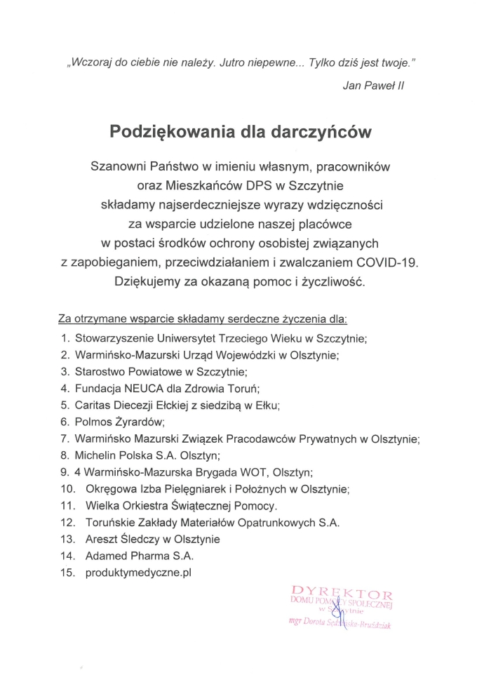

Treść skanu opublikowanego przez Dom, przepisana słowo w słowo:

> „Wczoraj do ciebie nie należy. Jutro niepewne… Tylko dziś jest twoje.”
>
> Jan Paweł II

## Podziękowania dla darczyńców

Szanowni Państwo w imieniu własnym, pracowników oraz Mieszkańców DPS w Szczytnie składamy
najserdeczniejsze wyrazy wdzięczności za wsparcie udzielone naszej placówce w postaci
środków ochrony osobistej związanych z zapobieganiem, przeciwdziałaniem i zwalczaniem
COVID-19. Dziękujemy za okazaną pomoc i życzliwość.

Za otrzymane wsparcie składamy serdeczne życzenia dla:

1. Stowarzyszenie Uniwersytet Trzeciego Wieku w Szczytnie;
2. Warmińsko-Mazurski Urząd Wojewódzki w Olsztynie;
3. Starostwo Powiatowe w Szczytnie;
4. Fundacja NEUCA dla Zdrowia Toruń;
5. Caritas Diecezji Ełckiej z siedzibą w Ełku;
6. Polmos Żyrardów;
7. Warmińsko Mazurski Związek Pracodawców Prywatnych w Olsztynie;
8. Michelin Polska S.A. Olsztyn;
9. 4 Warmińsko-Mazurska Brygada WOT, Olsztyn;
10. Okręgowa Izba Pielęgniarek i Położnych w Olsztynie;
11. Wielka Orkiestra Świątecznej Pomocy.
12. Toruńskie Zakłady Materiałów Opatrunkowych S.A.
13. Areszt Śledczy w Olsztynie
14. Adamed Pharma S.A.
15. produktymedyczne.pl

Dyrektor Domu Pomocy Społecznej w Szczytnie, mgr Dorota Sędzińska-Bruździak

